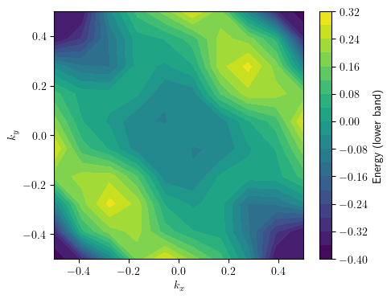

<!-- ABOUT THE PROJECT -->
## About The Project

This tool is designed to random one orbital band structures.  

<p align="right">(<a href="#readme-top">back to top</a>)</p>

### Prerequisites

* mp_api 
  ```sh
   conda install conda-forge::mp-api 
  ```
 * mpcontribs
  ```sh
  mamba install mpcontribs-client
  ```
 * PyTorch
   ```sh
   conda create --name triqs python pytorch cpuonly -c pytorch
   ```
 * scipy
 * sklearn
<p align="right">(<a href="#readme-top">back to top</a>)</p>
 
<!-- USAGE EXAMPLES -->
## Usage

Notebooks:
* *get_2d_BS *: Prepare database for training
* *autoenc_train*: Train ML model to generate BS 

```python
random_vector = torch.randn(1, latent_dim)

# Decode the random vector to get an output image
with torch.no_grad():
    random_decoded_output = model.decode(random_vector).cpu().detach().numpy()

plot_im(random_decoded_output[0,0])

```


<p align="right">(<a href="#readme-top">back to top</a>)</p>

<!-- CONTACT -->
## Contact

Egor Agapov -  agapov.em@phystech.edu

Project Link: [https://github.com/EgorcaA/band_gen](https://github.com/EgorcaA/band_gen)
<p align="right">(<a href="#readme-top">back to top</a>)</p>
 
